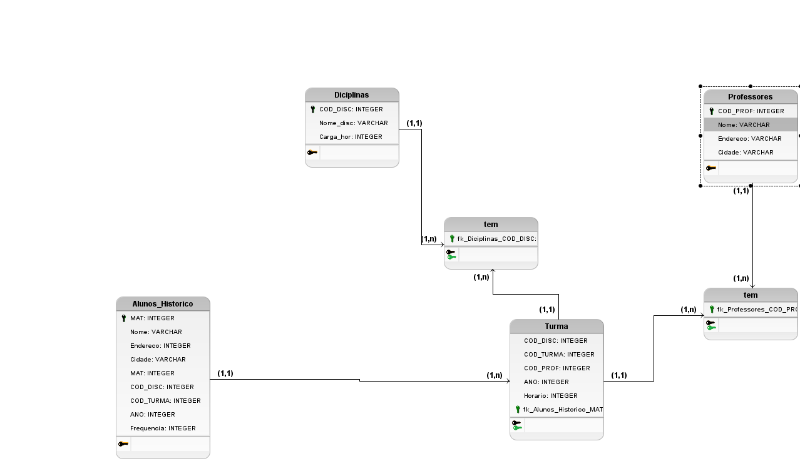

# Prova de Banco de Dados
Modelo Conceitual

Modelo Lógico

#  explicaçao
No modelo conceitual temos as entidades com os seguintes atributos:

aluno : materia , nome, endereço,cidade.

historico:   materia,codigo da diciplina,codigo da turma,ano e frequencia.

turma: codigo da disciplina,codigo da turma , codigo do professor, ano e horario.

professores: codigo do professor , nome ,endereço, cidade.

diciplinas: codigo da diciplina, nome da diciplina ,carga horaria.

 No modelo logico iremos especificar os tipos das colunas como varchar,int,primary ,foreign
